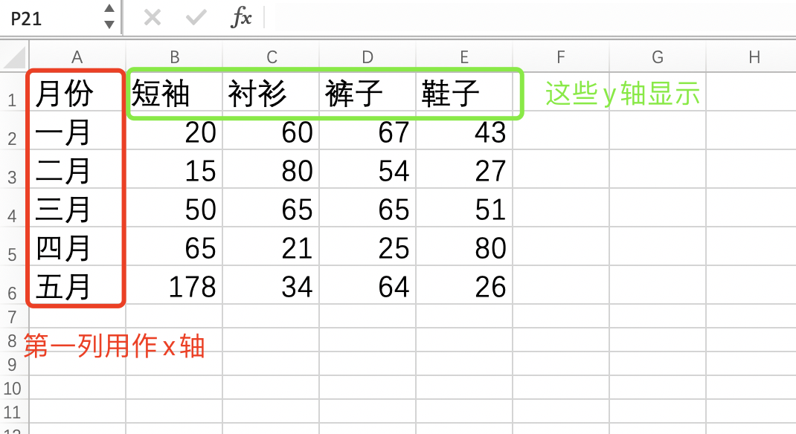
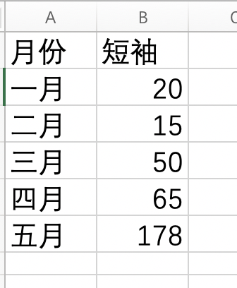
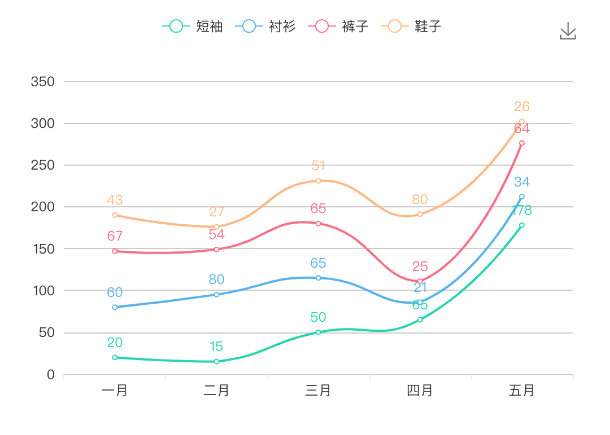

# Excel To Echarts
将 Excel 表格数据转化为 Echarts 图表，并下载成图片。

目前支持图表：
- 折线图
- 柱状图
- 条形图
- 散点图
- 饼图
- 环图

## 说明
我不知道你的 excel 表格是什么样，所以你需要按照我设定的格式去整理你的表格，才可以正常使用本功能。它的格式需如下：

一个最基本的满足条件的表格，需要两列：

渲染成一个折线图的样式：

## 开发历程
1. 最开始使用原生 `echarts` 来开发，但自己封装太费时，最后选用 `v-charts` 这个已经封装好的插件；
2. 使用 `v-charts` 的 `ve-chart` 组件，可以完成切换图表，但是有些图表无法渲染成功，如 `散点图`。并且每个图表的一些配置项是不一样的，需要去各自适配，这样在一个组件上完成各种图表的适配就比较繁杂，即使使用 `mixin` 的方式拆分代码，写到最后也比较混乱。所以这种方式也被放弃，这部分代码参考 `src/views/old_chart` 目录；
3. 最后还是决定基于 `v-charts` 提供的各个组件再次封装，主要将设置项封装进去，虽然很多设置是重复的，但也变得更灵活。并且一些绝对公共的设置也单独拆分出来，比如 标题的设置。封装的组件参考 `src/components/Charts` 目录。

## 后记
才发现 excel 软件自带了图表功能，表示我是一个用不到 excel 的社畜，所以不了解。不过看样子没有我这个好看，至少颜色比它好看。😂

很多想法还没做，要多思考思考。